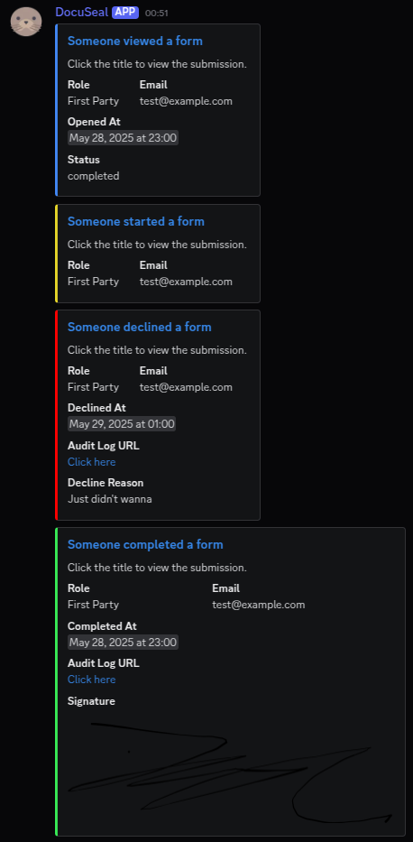

# DocuSeal Discord Redirector

A webhook server that receives DocuSeal form events and forwards them to Discord as rich embeds.

## Features

- Receives DocuSeal webhook events (form viewed, started, completed, declined)
- Forwards events to Discord with formatted embeds
- Color-coded messages based on event type
- Includes signature images for completed forms
- API key authentication for security

## Example Discord Message



## Setup

### 1. Configuration

Copy the example environment file and configure:

```bash
cp .env.example .env
```

Edit `.env` with your settings:

```env
PORT=8080
KEYS_FILE=keys.txt
DISCORD_WEBHOOK_URL=https://discord.com/api/webhooks/YOUR_WEBHOOK_URL
```

### 2. API Keys

Create or edit `keys.txt` with your authorized API keys (one per line):

```
your-secret-api-key-1
your-secret-api-key-2
```

Lines starting with `#` are treated as comments.

### 3. Run with Docker (Recommended)

```bash
# Build and run with docker-compose
docker-compose up -d

# View logs
docker-compose logs -f

# Stop
docker-compose down
```

**Docker Configuration:**

- The application runs on port 8080 by default
- Mount your `keys.txt` and `.env` files from the host
- Uses Go 1.21 LTS for reliability
- Includes health checks and automatic restarts
- Runs as non-root user for security

### 4. Build and Run Locally

```bash
# Install dependencies
go mod download

# Build
go build -o main ./cmd/server/main.go

# Run
./main
```

Or use Air for development with hot reload:

```bash
air
```

## Usage

### Webhook Endpoint

The server exposes a webhook endpoint at:

```
POST /incoming/{key}
```

Where `{key}` must be one of the authorized keys from your `keys.txt` file.

### DocuSeal Configuration

Configure DocuSeal to send webhooks to:

```
https://your-domain.com/incoming/your-secret-api-key-1
```

### Supported Events

- **form.viewed** - Blue embed when someone views a form
- **form.started** - Yellow embed when someone starts filling a form
- **form.completed** - Green embed when a form is completed (includes signature)
- **form.declined** - Red embed when a form is declined

## Production Deployment

### Docker in Production

For production deployment, consider:

1. **Environment Variables**: Set `DISCORD_WEBHOOK_URL` directly in production environment
2. **Port Mapping**: Change the host port if needed: `"80:8080"`
3. **SSL/TLS**: Use a reverse proxy (nginx, traefik) for HTTPS
4. **Monitoring**: The health check endpoint is available for load balancers
5. **Secrets**: Store API keys securely, not in plain text files

### Example Production docker-compose

```yaml
version: "3.8"
services:
  docuseal-discord-redirector:
    build: .
    restart: always
    environment:
      - PORT=8080
      - KEYS_FILE=/app/config/keys.txt
      - DISCORD_WEBHOOK_URL=${DISCORD_WEBHOOK_URL}
    volumes:
      - /secure/path/keys.txt:/app/config/keys.txt:ro
    labels:
      - "traefik.enable=true"
      - "traefik.http.routers.docuseal.rule=Host(`webhooks.yourdomain.com`)"
```

## License

This project is licensed under the GNU Affero General Public License v3.0.
